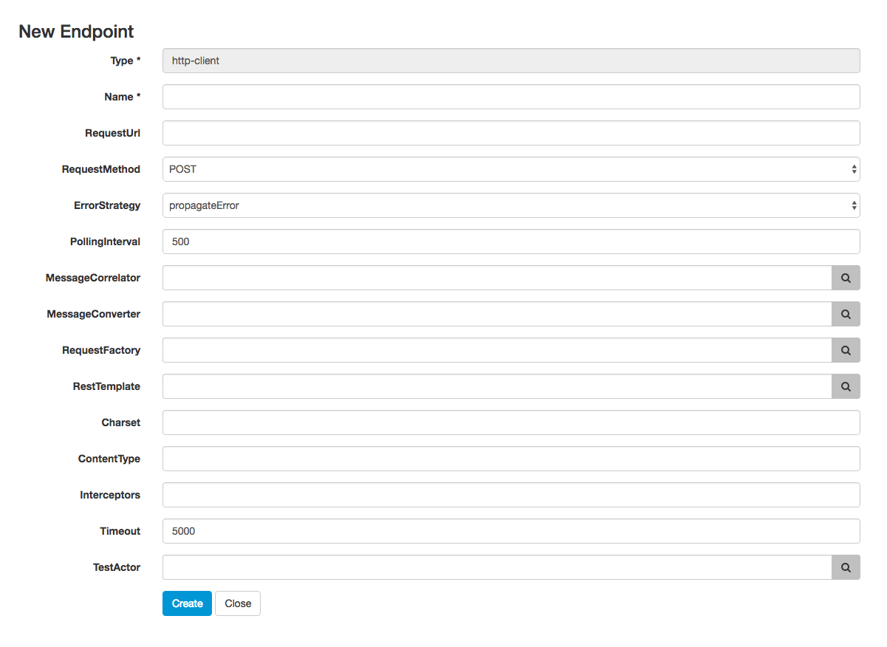

## Endpoint configuration

Endpoints are essential in a Citrus project. They define client and server components as well as producer and consumer for different message transports.

First of all the list of all available endpoints in the project is displayed. Each endpoint represents a message transport such as SOAP, JMS, REST, Mail, FTP and so on.
You can add new endpoints using the *New* context menu on the right. You need to chose the endpoint type first. Then a HTML form is displayed holding the endpoint settings.

Click save to add the new endpoint. Citrus is working with Spring XML configuration files. This means that the new endpoint component is saved as XML Spring bean to the basic 
Spring application context file. Usually this is a file located in *src/test/resources/citrus-context.xml* in your project. After you have saved the new component you will see that a new
entry has been added to this file.

You can also edit endpoint components in the administration UI. Just click an an existing endpoint component and you will see the HTML form with all the settings to this endpoint. 

If you save the changes Citrus will again change the Spring bean component in the XML configuration file. You can manually review the changes made. All manual changes in the Spring application context
will also affect the administration UI. Just hit the reload button in your browser to reload the configuration.
