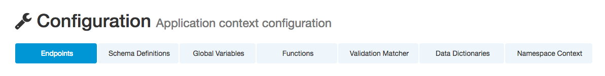

## Configuration

The Citrus components such as endpoints, variables, functions, schemas and dictionaries are configured in a Spring application context. The administration UI is able to read and change the Citrus components configuration.
Each component category is represented in the configuration page.

You can do show/edit the following configuration:

* [Endpoints](config-endpoints.md)
* [Global Variables](config-global-variables.md)
* [Namespace Context](config-namespace.md)
* [Data Dictionaries](config-dictionaries.md)
* [Functions](config-functions.md)
* [Validation Matcher](config-matcher.md)
* [Schema Repositories](config-schemas.md)