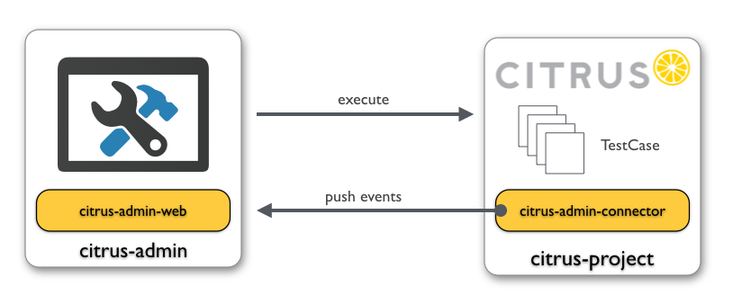

## Admin connector library

In the previous chapter we have seen how to customize the project and build settings for the active project. Now when
the administration UI executes some Citrus tests we can make use of a special admin-connector library that provides detailed
information on the test run and its outcome.

The admin UI tries to get test run information by parsing the logging output. We can extend this mechanism by adding a connector
library as dependency to the target project.

In general this is a Maven dependency that is added to the target project:

```
<dependency>
  <groupId>com.consol.citrus</groupId>
  <artifactId>citrus-admin-connector</artifactId>
  <version>${citrus.admin.version}</version>
</dependency>
```

Basically this little helper library provides detailed information during the test run by pushing events to the admin UI.



The citrus-admin-connector is part of the Citrus project and is automatically loaded when tests are run. The connector library
registers special test listeners and pushes information to the citrus-admin web application. This way the admin UI is able to
display runtime information of the tests such as exchanged messages, test results and so on.

You can automatically activate/deactivate the connector library in the project settings. This will automatically add or remove
the citrus-admin-connector Maven dependency for you.

