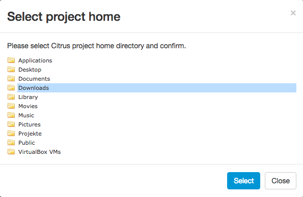

## Open project

You can open any Citrus project. The only prerequisit is that you have access to the project home on your local machine. When the administration UI is
started you have to open a project first.


The project home selection form is displayed automatically when no project has been selected yet. You can preselect a project home when starting the administration UI
by setting a system environment variable at startup:

```java -jar -Dproject.home=/Users/myaccount/path/tp/citrus/project/home citrus-admin-web-1.0.0-beta-1.jar```

When pre selecting a project home the project is opened automatically and the [project dashboard](project-dashboard.md) is displayed. Now back to the project home selection if no project has bee pre selected yet.

You need to specify the project home which is the root directory of your Citrus project. You can specify the complete path manually or pick the home directory over the file browser.



Once you have specified the project home you are ready to hit the **Open** button. Citrus will read the project information and open the [project dashboard](project-dashboard.md). The administration UI is looking
for several things in your project in order to gain information about the project. The files scanned are:

| Path                    | Description                           |
| ----------------------- | ------------------------------------- |
| **${project-home}/pom.xml** | Reads information from Maven POM  |
| **${project-home}/src/test/resources** | Reads XML test cases   |
| **${project-home}/src/test/resources/citrus-context.xml** | Reads Spring bean configuration |
| **${project-home}/src/test/java** | Reads test cases |

### Customize project settings

It is possible that your project uses a different folder layout for test resources and test sources (e.g. *src/it/resources* and *src/it/java*). Then the project open operation will fail with errors. We can fix this by customizing the project settings
manually in prior to opening the project. 

There are two different approaches to customizing the project settings: First of all you can use system properties when starting the administration UI application:

```java -jar -Dproject.home=/Users/myaccount/path/tp/citrus/project/home -Djava.source.directory=src/it/java 
-Dxml.source.directory=src/it/resources citrus-admin-web-1.0.0-beta-1.jar```

You can set the following system properties:

| Property                | Description                           |
| ----------------------- | ------------------------------------- |
| project.home            | Preselect project on startup          |
| root.directory          | System root as base of all projects (default: user home directory) |
| java.source.directory   | Java sources directory (default: *src/test/java*)         |
| xml.source.directory    | XML test sources directory (default: *src/test/resources*) |
| spring.application.context | Path to Spring application context file (default: *src/test/resources/citrus-context.xml*) |

A second approach would be to create a project settings file in your Citrus project root directory. The project settings are stored in a file called **citrus-project.json**. When you open a Citrus project for the first time the administration UI creates this project settings file
automatically. But now we want to create this file manually in order to set custom directories and settings prior to opening the project. The setting file uses JSON data format and looks like this:
 
```
{
  "projectHome" : "~/Projects/Citrus/citrus-sample",
  "name" : "citrus-sample-project",
  "description" : "",
  "version" : "1.0.0",
  "testCount" : 0,
  "settings" : {
    "basePackage" : "com.consol.citrus",
    "citrusVersion" : "2.6",
    "springApplicationContext" : "src/it/resources/citrus-context.xml",
    "javaSrcDirectory" : "src/it/java/",
    "xmlSrcDirectory" : "src/it/resources/",
    "javaFilePattern" : "/**/*Test.java,/**/*IT.java",
    "xmlFilePattern" : "/**/*Test.xml,/**/*IT.xml",
    "build" : {
      "@class" : "com.consol.citrus.admin.model.build.maven.MavenBuildConfiguration",
      "type" : "maven",
      "properties" : [ ],
      "testPlugin" : "maven-failsafe-plugin",
      "profiles" : null
    }
  }
}
```

So you can force the administration UI to use these settings when opening the project. Just create the **citrus-project.json** file in the Citrus project home directory before opening the project. 
