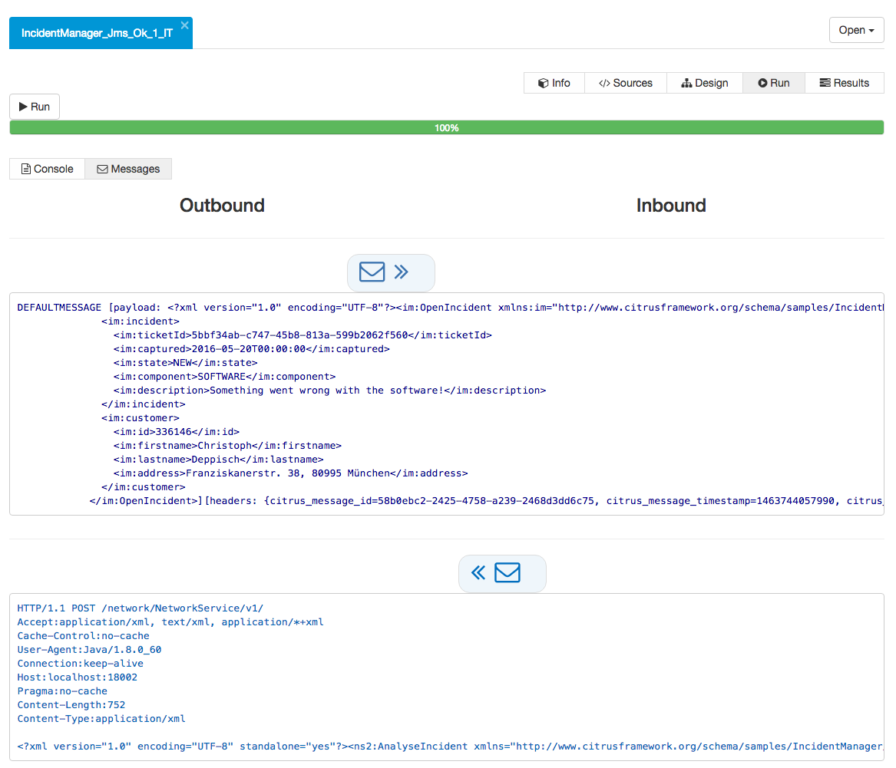

## Execute tests

Test execution is a very powerful feature as it enables you to execute your tests within a browser environment almost everywhere. Just hit the *Run* button and Citrus will start a new background process that executes the
test case immediately. At the moment we do only support Maven test execution. This means that a new Maven process is launched in background executing the test.


As you can see the test log output is forwarded to your browser. Also the test progress and result (success or failure) is tracked by the administration UI. In the messages tab you are able to review all messages (inbound/outbound)
that have been exchanged during the test run.



The message panel displays all inbound and outbound messages. Click on the envelope to see the message content details. The mechanism for tracking inbound and outbound messages in the administration UI is working with a special message 
listener that you have to add to your Citrus project:

```
<bean class="com.consol.citrus.admin.connector.WebSocketPushEventListener">
  <property name="host" value="localhost"/>
  <property name="port" value="8080"/>
</bean>
```

As you can see the connector is pushing message data to the administration UI using a WebSocket API on the administration UI server. The *host* and *port* properties are customizable, default values are *localhost* and *8080*. When a test is executed
the message listener will automatically connect and push messages exchanged to the administration UI.

Of course the administration UI server has to be accessible during the test run. The message listener will automatically test the server connectivity at the beginning of the test run. In case the administration UI is not accessible the message push
feature is simply disabled. So you can continue to work with your Citrus project even if the administration UI is not started. 

Do not forget to add the **citrus-admin-connector** as dependency to the Citrus project Maven POM:

```
<dependency>
  <groupId>com.consol.citrus</groupId>
  <artifactId>citrus-admin-connector</artifactId>
  <version>1.0.0</version>
</dependency>
```

This is how the administration UI is able to track messages exchanged during a test run. Stay tuned for more features related to the test execution and message exchange.