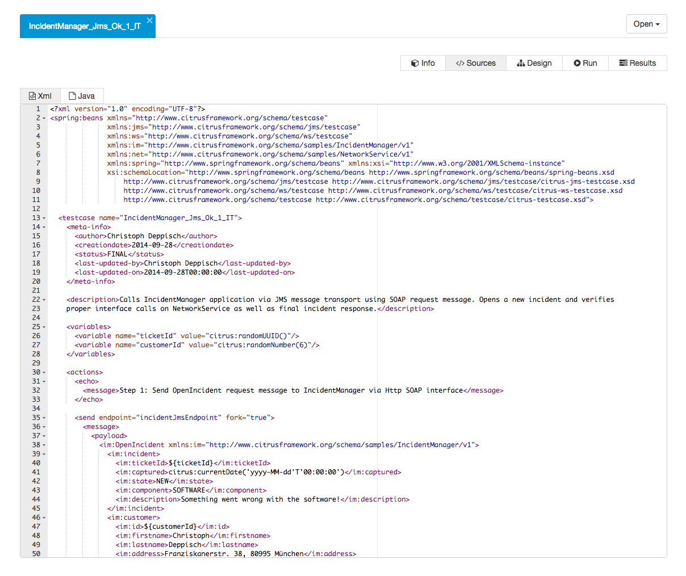

## Open tests

The administration UI is able to open your test cases. Both XML and Java DSL test cases are supported.

**NOTE:** Java DSL test cases might cause some problems when loading the test design view. this is because we do have to make the Java DSL code interpretation more stable.

You can open the tests using the *Open* context menu. All available test cases are grouped by their package. 

Choose a test and open it in order to see the basic test case information such as name, author, status and description.

Next to to the test case info you can view the test source code. This is either a XML test or the Java DSL code.

At the moment these information is read only. Stay tuned for some code editing features that might come in the future. Another representation of the test sources is
the [test design](test-design.md) view. The design view brings the test actions to a graphical representation. 

Now a very powerful feature is to execute the test using the administration UI. Let's go and read about [test execution](test-execute.md).